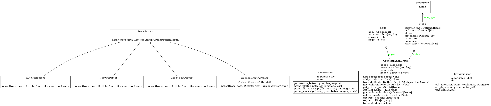
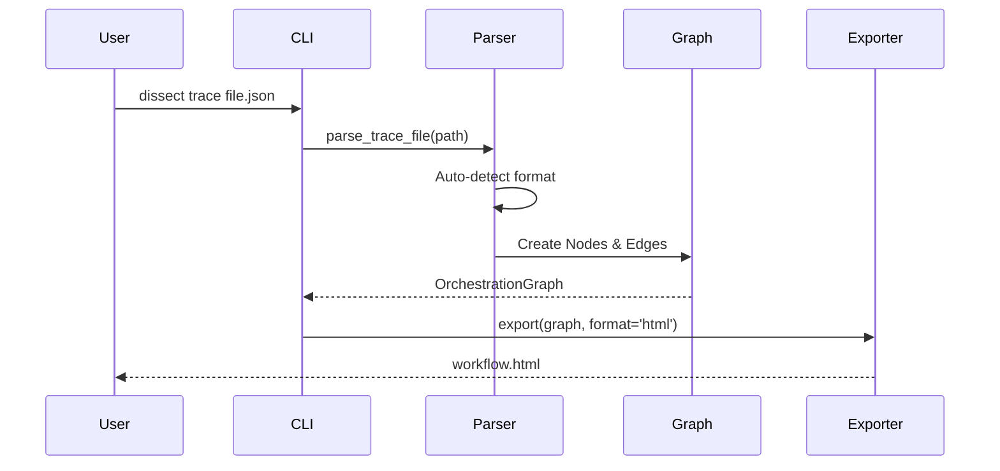

# Dissect

> **Visualize AI Agent Workflows** | LangChain • CrewAI • AutoGen • OpenTelemetry

[](LICENSE)
[](https://python.org)
[](tests/)
[](https://github.com/astral-sh/ruff)
[](https://github.com/Lemniscate-world/Dissect)

Dissect helps you understand what's happening inside your AI agent systems. Parse traces, visualize workflows, and identify bottlenecks.


## Features

- 🔌 **Multi-Framework Support** – Works with LangChain, CrewAI, AutoGen, and any OpenTelemetry-compatible system
- 📊 **Beautiful Visualizations** – Interactive HTML, Mermaid diagrams, Graphviz DOT
- ⏱️ **Critical Path Analysis** – Identify the slowest paths in your workflows
- 🚀 **Zero Config** – Auto-detects trace formats

## Quick Start

```bash
# Install
pip install dissect

# Parse a trace file
dissect trace --file trace.json

# Generate interactive HTML visualization
dissect visualize --file trace.json --format html --output workflow.html

# Generate Mermaid diagram
dissect visualize --file trace.json --format mermaid --output workflow.md
```

## Example Output

```
✓ Parsed successfully!
  Name: Trace
  Nodes: 7
  Edges: 6

  Critical Path (750ms):
    → User Query (50ms)
    → Writer Agent (400ms)
    → Claude Call (300ms)
```

## Supported Trace Formats

| Format | Auto-Detected By |
|--------|------------------|
| OpenTelemetry | `spans` or `resourceSpans` field |
| LangChain | `runs` or `run_type` field |
| CrewAI | `crew_name`, `agents` + `tasks` |
| AutoGen | `agents` + `messages` |

## Visualization Formats

| Format | Command | Use Case |
|--------|---------|----------|
| HTML | `--format html` | Interactive exploration |
| Mermaid | `--format mermaid` | Documentation, GitHub |
| DOT | `--format dot` | Graphviz rendering |
| JSON | `--format json` | Programmatic access |

## Development

```bash
# Clone
git clone https://github.com/Lemniscate-world/Dissect.git
cd Dissect

# Install in dev mode
pip install -e .

# Run tests
python -m pytest
```

## Roadmap

- [x] Multi-framework trace parsing
- [x] HTML/Mermaid/DOT export
- [x] Critical path analysis
- [x] 🌡️ Latency Heatmaps (Bottleneck detection)
- [x] `dissect explain` (AI-powered insights)
- [ ] `dissect watch` (Live trace streaming)
- [ ] VS Code extension
- [ ] Dissect Cloud (hosted dashboard)

## Architecture

### Class Diagram


### Sequence Diagram


## License

Apache 2.0 – see [LICENSE](LICENSE)

---

Built with ❤️ by [Lemniscate World](https://github.com/Lemniscate-world)
